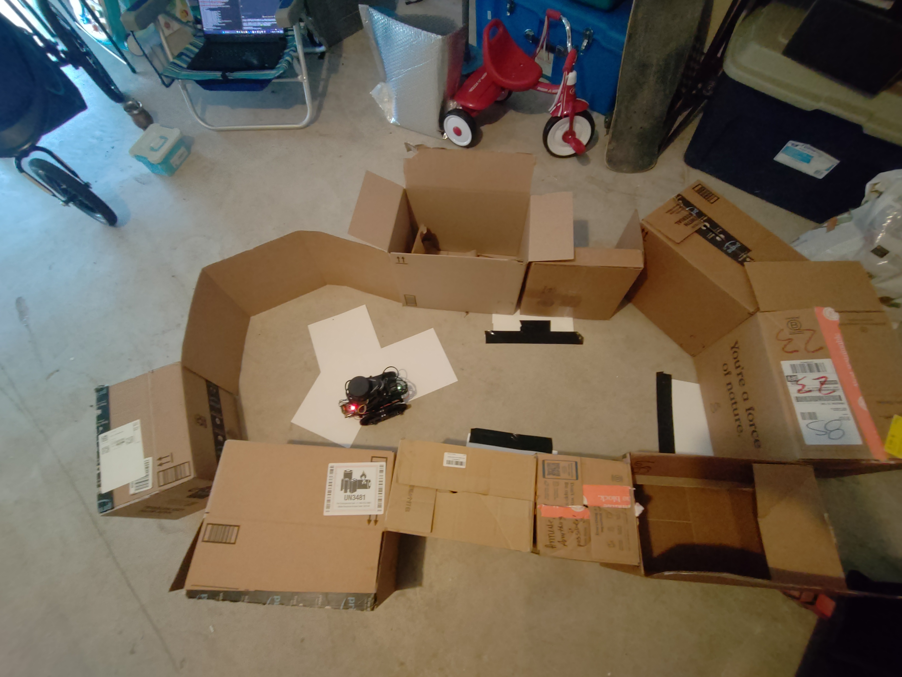
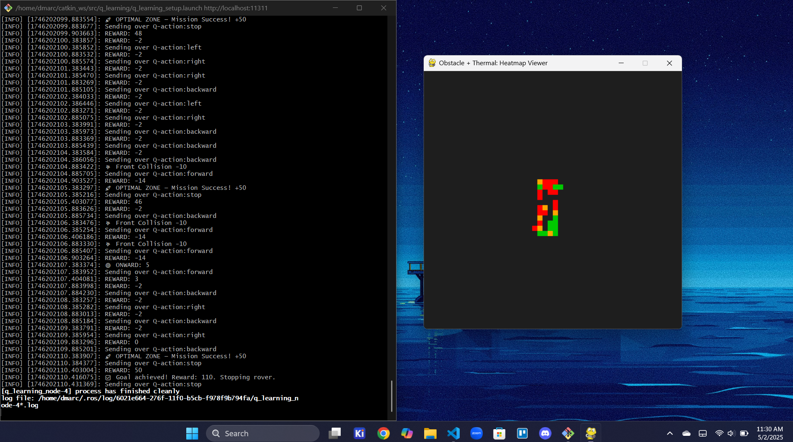

# QRoq: A Self Learning Rover for Harsh Environments

PQRoq is a reinforcement learning–based rover designed to simulate autonomous survival in remote areas. It leverages Python-based ROS-Nodes, Raspberry Pi 3B, LIDAR, IR sensors, and a heatmap-based environment tracker to safely find optimal resting zones while avoiding thermal and obstacle hazards.

## 🚀 Features

- **Reinforcement Learning (Q-Learning)** to teach the rover survival behavior and allow it to learn to traverse any environment
- **IR and LIDAR sensor integration** for hazard detection
- **Thermal + Obstacle Heatmap** visualization run on Windows computer using pygame and heatmap json served via Flask from the PI
- **Modular ROS Node Architecture** for rapid upgrades and algorithm experimentation

## 🧠 Tech Stack

- Python 3
- ROS (Robot Operating System)
- Flask (heatmap API endpoint)
- Pygame (PC-side visualizer)
- Sensor: YDLidar x4-Pro, IR Sensor
- Raspberry Pi Model B

## 📡 Usage

On the Raspberry Pi:
```bash
cd catkin_ws
source devel/setup.bash
# Terminal 1 Start lidar
roslaunch ydlidar_ros_driver X4-Pro.launch
# Terminal 2 Start heatmap server
rosrun heatmap heatmap_node.py
# Terminal 3 launch qlearning, motor control, state, ir, and qaction nodes
roslaunch q_learning q_learning_setup.launch
```

On your PC:
```bash
python heatmap_visualizer.py
```

Set `ROVER_URL` in the visualizer to your Pi's IP address.

## 🖼️ Visual Output


- Color-coded heatmap (Green = Safe, Orange = Caution, Red = Hazard)
- Zero-value cells(Black) indicate unvisited regions

## 🛠️ Future Work
- Genetic algorithm navigation strategy
- Full SLAM map + path optimization
- Autonomous task scheduling in hostile environments
- Autonomous charging with a solar panel

## 📃 License

[MIT License](./LICENSE)

## Author
Built by Damon Rocha — inspired by robotics, nature, and AI to solve real-world problems.
